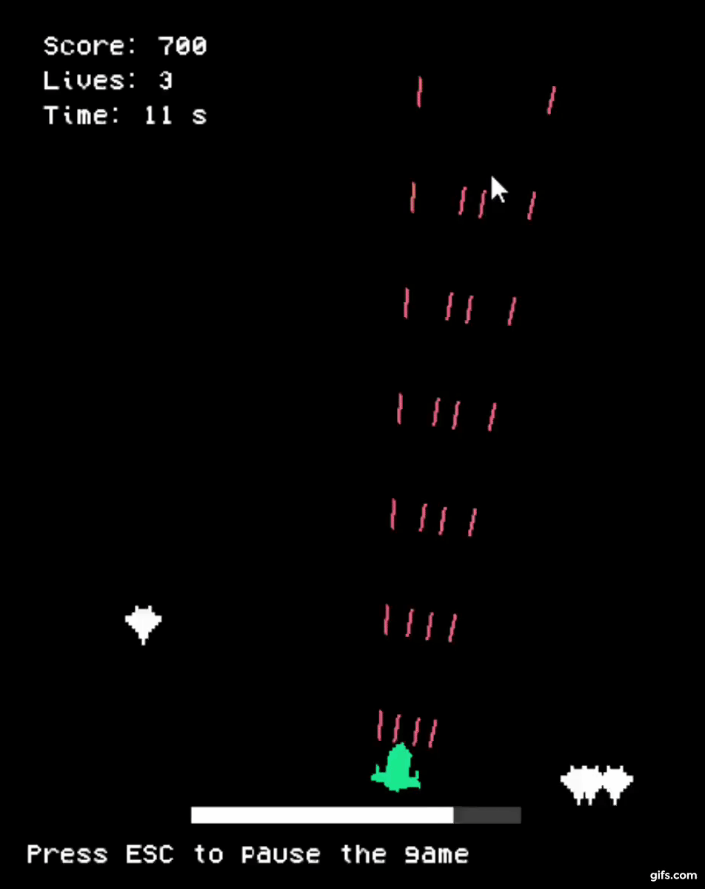

# Space Shooter Game in C using the SDL Library

This is a project I worked on for my Introduction to Programming course. I went with creating an arcade video game as I wanted to pursue a fun and challenging project, one that would go beyond the simple command-line interface of the output console in Visual Studio. With the SDL library, I was able to import and use sprites, sound files and other assets and have them show up in a separate window running at 60 fps.

Creating and managing object instances was a challenge due to the procedural nature of C. Therefore, I opted to use an array of enemy instances to randomly create enemies at the top of the screen and have them destroyed when they were shot at by the player or when they passed through the bottom of the screen.

 

  

 

Date of creation: December 2017  
Type of project: Semester project

**Important**: If you're on Windows, place the <code>C Libraries</code> folder (containing the SDL libraries) in Local Disk C. Alternatively, you can re-link the libraries in Visual Studio by following this [guide](https://www.wikihow.com/Set-Up-SDL-with-Visual-Studio).
